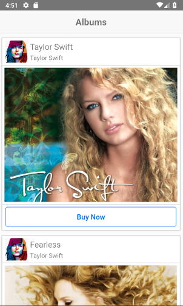
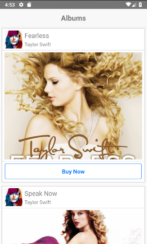

# Music Album
Buy Music Online App with ReactNative. This is a practice project while i am following a course !
## Demo

## How to create your own copy of this app?
### Prerequisites
To create an own copy of this application, you have some prerequisites. They are -

 - [NodeJS](https://nodejs.org/en/) installed on your system.
 - [React Native](https://facebook.github.io/react-native/) installed on your system.
 - Have the [Android SDK](https://developer.android.com/studio/index.html) and paths set properly. 
 - An android emulator or real device to run the app.
 
### Make own copy
First clone the repository using:

    git clone https://github.com/robin3317/react-native-music-album.git

Then install the dependencies using:

    npm install

Then run the React Native server using:

    react-native start

Open your emulator and wait until it completely boot up. Then run the following command to run the app on the emulator.

    react-native run-android
Now, you have your own copy of this application!

## Credits
 - [React](https://facebook.github.io/react/)
 - [React Native](https://facebook.github.io/react-native/)

Made with ♥ by [Abdur Rahman Robin](https://twitter.com/robin4java)
